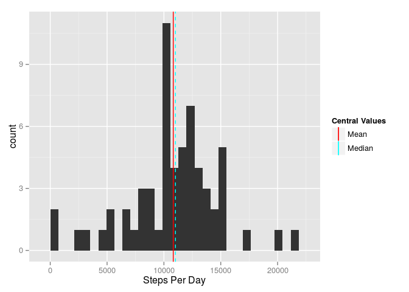

# Reproducible Research: Peer Assessment 1


## Loading and preprocessing the data
  
  
**Code to read in and process the data:**

```r
options(scipen=999)
library(lubridate)
# setwd("RepData_PeerAssessment1")
unzip("activity.zip","activity.csv")
activity <- read.csv(file = "activity.csv")
activity$date <- ymd(activity$date)
```


## What is mean total number of steps taken per day?

```r
library(ggplot2)
suppressPackageStartupMessages(library(dplyr,quietly = TRUE))
stepsPerDay <- activity %>% 
  group_by(date) %>% 
  summarize("total" = sum(steps))
# stepsPerDay <- activity %>% group_by(date) %>% summarize("total" = sum(steps,na.rm=TRUE))
meanStepsPerDay   <- mean(stepsPerDay$total,na.rm=TRUE)
medianStepsPerDay <- median(stepsPerDay$total,na.rm=TRUE)
ggplot(stepsPerDay,aes(x=total))+
  geom_histogram()+
  geom_vline(aes(xintercept=meanStepsPerDay,linetype="Mean",color="Mean"),show_guide=TRUE)+
  geom_vline(aes(xintercept=medianStepsPerDay,linetype="Median",color="Median"),show_guide=TRUE)+
  scale_linetype_manual(name="Central Values", values=c(Mean="solid",Median="dashed"), guide=FALSE)+
  scale_color_manual(name="Central Values",values=c(Mean="red",Median="cyan"))+
  xlab("Steps Per Day")+
  ggtitle("Histogram of Total Steps Taken Each Day")
```

 

```r
c(meanStepsPerDay,medianStepsPerDay,sum(stepsPerDay$total,na.rm=TRUE))
```

```
## [1]  10766.19  10765.00 570608.00
```

**Mean** steps per day: 10766.1886792  
**Median** steps per day: 10765  
**Total** steps: 570608


## What is the average daily activity pattern?


```r
stepsPerInterval <- activity %>% 
  group_by(interval) %>% 
  summarize("average" = mean(steps,na.rm=TRUE))
ggplot(stepsPerInterval,aes(x=interval,y=average))+
  geom_line()+
  xlab("5 Minute Interval")+
  ylab("Mean Steps per 5 Minute Interval")+
  ggtitle("Average Number of Steps Taken (Averaged Across All Days)")
```

 

```r
maxAverageInterval <- arrange(stepsPerInterval,desc(average))
maxAverageInterval[1,]
```

```
## Source: local data frame [1 x 2]
## 
##   interval  average
## 1      835 206.1698
```

The **five-minute interval with largest number of average steps** is number: 835.  
This interval had an average of 206.1698113 steps.  

## Imputing missing values


```r
numRowsWithNA <- sum(!complete.cases(activity))
numRowsWithNA
```

```
## [1] 2304
```

There are 2304 rows with NAs in the original data.  

**Strategy for imputing missing data:**  
Each row with missing data will have data imputed. The imputed value will equal the global average for that 5-minute interval on that day of the week.

**Code for imputing missing data:**

```r
imputedActivity <- activity %>% 
  group_by(wday(date)) %>% 
  mutate(dailyAverage = mean(steps,na.rm = TRUE))
imputedActivity[!complete.cases(imputedActivity),"steps"] <- 
  imputedActivity[!complete.cases(imputedActivity),"dailyAverage"]
imputedActivity <- imputedActivity[,c("steps","date","interval")]
imputedStepsPerDay <- imputedActivity %>% 
  group_by(date) %>% 
  summarize("total" = sum(steps))
imputedMeanStepsPerDay   <- mean(imputedStepsPerDay$total)
imputedMedianStepsPerDay <- median(imputedStepsPerDay$total)
```

### The Impact of Imputing Missing Values


```r
ggplot(imputedStepsPerDay,aes(x=total))+
  geom_histogram()+
  geom_vline(aes(xintercept=imputedMeanStepsPerDay,linetype="Mean",color="Mean"),show_guide=TRUE)+
  geom_vline(aes(xintercept=imputedMedianStepsPerDay,linetype="Median",color="Median"),show_guide=TRUE)+
  scale_linetype_manual(name="Central Values", values=c(Mean="solid",Median="dashed"), guide=FALSE)+
  scale_color_manual(name="Central Values",values=c(Mean="red",Median="cyan"))+
  xlab("Steps Per Day")
```

 

```r
c(imputedMeanStepsPerDay,imputedMedianStepsPerDay,sum(imputedStepsPerDay$total))
```

```
## [1]  10821.21  11015.00 660093.79
```

Imputed **Mean** steps per day: 10821.2096019  
Imputed **Median** steps per day: 11015  
Imputed **Total** steps: 660093.7857143


```r
fracOriginallyMissing <- sum(is.na(activity$steps))/nrow(activity)
fracImputedIncrease   <- (sum(imputedStepsPerDay$total)-sum(stepsPerDay$total,na.rm=TRUE))/sum(stepsPerDay$total,na.rm=TRUE)
c(paste(round(100*fracImputedIncrease, 2),"%", sep=""),paste(round(100*fracOriginallyMissing, 2), "%", sep=""))
```

```
## [1] "15.68%" "13.11%"
```

Total step count has increased 15.68%, which is in-line with expectation, as 13.11% rows of rows were imputed.  

The slight increase in mean and median step counts per day is because missing values were disproportionately imputed more from Mondays and Fridays, and less from Tuesdays.


```r
activity %>% 
  group_by(wday(date,label = TRUE)) %>% 
  summarise(fracNAs = sum(is.na(steps))) %>% 
  mutate(fracNAs = paste(round(100*fracNAs/sum(fracNAs), 2),"%",sep=""))
```

```
## Source: local data frame [7 x 2]
## 
##   wday(date, label = TRUE) fracNAs
## 1                      Sun   12.5%
## 2                      Mon     25%
## 3                     Tues      0%
## 4                      Wed   12.5%
## 5                    Thurs   12.5%
## 6                      Fri     25%
## 7                      Sat   12.5%
```

## Are there differences in activity patterns between weekdays and weekends?


```r
factoredImputedActivity <- 
  imputedActivity %>% 
  mutate(wday = (wday(date))) %>% 
  mutate(wday = (wday>1 & wday<7)) %>% 
  mutate(wday = factor(wday,labels=c("weekend","weekday")))

averagedByWeekdayImputedActivity <- 
  factoredImputedActivity %>% 
  group_by(wday,interval) %>% 
  summarize(meanStepsPerInterval=mean(steps))

ggplot(averagedByWeekdayImputedActivity, 
       aes(x=interval,y=meanStepsPerInterval))+
  geom_line()+
  facet_wrap(~wday,nrow=2)+
  xlab("5 Minute Interval")+
  ylab("Mean Steps Per 5 Minute Interval")
```

 
